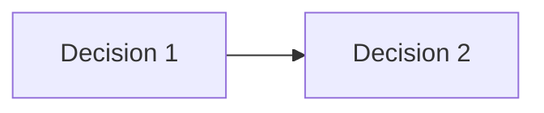

# Brainstorm Explore

Structured session: pick framework, decompose topic, systematically question, capture decisions, dump artifact at end.

## Activation

**Trigger phrases:**
- `/brainstorm <topic>`
- "Start brainstorm about <topic>"
- "Begin brainstorming on <topic>"

**Reject** if no topic: ask "What topic?"

**Reject** if another session active: "Finish the current brainstorm first (say 'end the brainstorm')"

## Framework Selection

Map topic to best framework:

| Framework | Best when topic is about |
|-----------|--------------------------|
| SWOT | Strategy, competition, product evaluation |
| First Principles | Innovation, assumptions, complex systems |
| 5W1H | Process design, feature planning, incidents |
| Six Thinking Hats | Balanced multi-angle evaluation |
| Problem-Solution Tree | Root cause, debugging, troubleshooting |
| Causal Chain | Dependency/ripple-effect analysis |
| Impact/Effort Matrix | Prioritization, resource allocation |
| Design Thinking | UX, product discovery, user problems |
| CICO | Architecture, code/design review |

**Tiebreaker:** Prefer the more *specific* framework (e.g., Design Thinking over 5W1H for UX). If still tied, pick highest topic coverage.

**No explicit approval needed.** Tell user the choice + rationale. If user wants different, switch.

**Mid-session pivot:** If discussion outgrows the framework, switch. Document: "Framework shift: <old> → <new>, reason: <...>".

## Session Protocol

### 1. Decompose (invisible, first turn)

After framework selection, decompose topic into N domains. Sort foundational first → derived. Example: "Push notifications" → [Platform support, Permission UX, Payload format, Delivery reliability, Analytics, Fallback]

Done silently. No output to user. The domain list is a session scaffold — never show it. First AI turn contains only: framework choice + rationale + first question.

### 2. Each AI Turn

Process user's prior input:
- **Answer** → log compact entry (2-3 lines) to in-memory artifact
- **Counter-question** → answer, then return to domain
- **Contradiction** → flag: "Earlier you said X, now Y — which is correct?"
- **Off-topic** → answer briefly, redirect: "Back to <domain> — <question>"
- **"I don't know"** → confusion → rephrase. Indifference → skip domain. Fatigue → offer end.
- **"Something else" 3× consecutive** → "My framing misses your thinking — how would you describe it?"

Then:
- Pick **ONE domain** (depth-first). Stay until fully explored or explicitly postponed.
- **"Fully explored"** = all questions for that domain have answers without ambiguity, or explicitly postponed with reason logged.
- Ask **1-3 questions**: first from current domain, remainder from next domains (breadth preview).
- **Every question must include an escape hatch:** for decision options → "Something else: [write in]". For open-ended framing → "Or am I missing something?". Never leave a question closed.
- **Sub-topic depth cap:** 3 levels. Deeper → note as "branched" in artifact, return.

### 3. Progress Signal (every 5 turns)

1-line: "Covered: <domains>. Decisions: <count>. Moving to <next>."

### 4. Final Verification (when all domains exhausted)

Before asking "Anything else?":
1. Self-audit the compact log. Find entries with ambiguous or incomplete answers.
2. Read `.ai/docs/meta/proactive-review.md` and run against the compact log:
   - Ambiguities: unresolved decisions? vague answers?
   - Missing context: gaps a future session would need?
   - Corner cases: edge/error/boundary not explored?
   - Testing: verification strategy per decision?
   - Security: user data, file I/O, network concerns?
   - Performance: heavy operations flagged?
   - Extensions + alternatives: natural follow-ups and rejected paths?
3. Present remaining gaps to user: "Some things are still open — <list gaps>. Want to resolve these or move them to Open Questions?"
4. Do NOT wait for user to catch incompleteness. Proactive verification is AI's responsibility.

## Decision Capture

When a question must settle:
1. AI suggests 2-4 options + "Something else: [write in]"
2. User picks, ranks (full ranking stored), or writes in
3. Log: `[accepted/rejected] <point> — <why>`
4. AI infers defaults for priority (P1/P2/P3), effort (S/M/L/XL), risk (low/med/high)
5. User adjusts all at end review

## Artifact

### In-Session (compact, invisible)

Per turn, store 2-3 lines in context:
```
domain: <name>
  Q: <question> → A: <answer> [accepted/rejected] {P1|P2|P3} {S|M|L|XL} {low|med|high}
  ranking: 1. X, 2. Y
  branched: <sub-topic> (not explored)
```

Never write intermediate files. Expand at dump only.

### Final Dump

On "end the brainstorm" (or any variant):

1. Expand compact log → full artifact
2. Ensure dir: `mkdir -p history/brainstorms/`
3. Slug: lowercase, spaces→hyphens, strip `[^a-z0-9-]`
4. If path exists → `-v2`, `-v3` suffix
5. Save to `history/brainstorms/<slug>.md`
6. Run `./tools/brainstorms/index.sh` to refresh the brainstorms INDEX.md
7. Show in chat: TLDR + file path only. Offer "show full artifact? (y/n)"

### Artifact Template

````markdown
# <Topic>
**Framework:** <name> (shifted from <old> if applicable)
**Date:** <YYYY-MM-DD>
**Duration:** <N> turns

## TLDR
<concise summary>

## Discussed
- [accepted/rejected] <point> — <why>

## Decisions
| # | Decision | Risk | Priority | Effort | Dependencies | Confidence |
|---|----------|------|----------|--------|--------------|------------|
| 1 | ... | med | P1 | M | #2 | 4/5 |

### Rankings
Decision 1: 1. Option A, 2. Option B

## Dependency Graph

(only when ≥1 dependency)

## Open Questions
- <unresolved>

## Actions
| Action | Priority | Effort |
|--------|----------|--------|
| ... | P1 | M |
````

### End Review (optional)

After dump, offer, don't require:
- "Want to fill confidence scores (1-5) per decision, or done?"
- If yes → each decision: confirm priority/effort/risk, assign confidence
- If no → skip, leave confidence blank in artifact
- Also offer: "Any open questions or actions to add?"

## OpenSpec Integration

After end review:
1. Ask: "Convert brainstorm output into an OpenSpec change proposal?"
2. **Wait for "yes"** (openspec-guide.md: "Approve before creating artifacts")
3. On yes:
   - `mkdir -p openspec/changes/<topic-slug>/`
   - `proposal.md` — TLDR → Why, Decisions → What Changes, Actions → Impact
   - `design.md` — Decisions section, rejected → "Alternatives considered", risks table
   - `tasks.md` — each Action as task
   - If path exists → `-v2` suffix

## Corner Cases

| Case | Handling |
|------|----------|
| Empty/no topic | Reject: "What topic?" |
| Double session | Reject: "Finish current brainstorm first" |
| Start → immediate end | Skeleton artifact: topic only, "Session ended immediately" in TLDR |
| Topic too broad | Narrow to first tangible domain. Note "Uncovered domains" in Open Questions |
| Contradiction | Flag, ask to resolve or mark as revision |
| Indecision | Move to Open Questions — don't stall |
| Sub-topic explosion | Cap at 3 levels. Note as "branched" |
| Off-topic | Answer briefly, redirect |
| Topic change mid-session | Reject: "End this brainstorm first, then start a new one" |
| Options miss user | Always include "Something else" |
| File collision (artifact) | Append `-v2`, `-v3` suffix |
| File collision (openspec) | Append `-v2` suffix |
| Bad slug chars | Sanitize: lowercase, spaces→hyphens, strip `[^a-z0-9-]` |
| User "I don't know" | Confusion → rephrase. Indifference → skip. Fatigue → offer end |
| Final verification skipped | Root cause of incomplete artifacts. Every all-domains-exhausted state MUST trigger audit |

## ADR Integration

When the session ends with concrete decisions (artifact has >=1 [accepted] entry):

1. After artifact dump + end review + OpenSpec offer, ask:
   "Want to create ADR drafts from the decisions?"

2. On yes → for each accepted decision:
   a. Propose an ADR title based on the decision
   b. Wait for explicit user approval per ADR
   c. On approval → run `./tools/adr/new.sh "<title>"` (creates as **proposed**)
   d. Fill the ADR template sections using the brainstorm's full context:
      - **Context and Problem Statement** → from the brainstorm topic + discussion
      - **Decision Drivers** → from the framework's exploration
      - **Considered Options** → from the options discussed
      - **Decision Outcome** → from the captured decision
      - **Consequences** → from the trade-off analysis
      - **More Information** → cross-reference other ADRs from this brainstorm
   e. Check that new.sh succeeded (exit code 0). If it failed, notify the user and suggest running it manually.
   f. Ask: "Ready to accept this ADR?" On yes → run `./tools/adr/status.sh <NNN> accepted`
   g. Notify user to commit: `docs(adr): add ADR for <title>`

3. If no accepted decisions exist → skip silently (no prompt).

## Termination

- Any variant: "end the brainstorm", "stop brainstorm", "finish brainstorm", "end brainstorming"
- Run final verification first if not already done
- Final artifact dump + optional end review + OpenSpec offer
- Run ADR Integration (see above)
- Reset session state (no active session flag)
