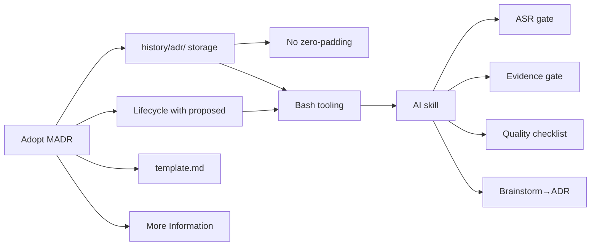

# ADR Process for KMP Project

**Framework:** 5W1H

**Date:** 2026-07-16

**Duration:** 40+ turns

## TLDR

Established a full ADR process for the KMP template project: MADR-based
template, 4-status lifecycle (proposed→accepted→implemented→deprecated),
bash tooling for creation and maintenance, AI skill for assisted ADR
creation, brainstorm→ADR pipeline, and structured gates (ASR, START,
evidence, quality). All decisions documented in ADR 1.

## Discussed

- [accepted] MADR template as baseline
- [accepted] `history/adr/` directory with single files per ADR
- [accepted] No zero-padding in numbering — `1-slug.md` not `001-adr-slug.md`
- [accepted] Lifecycle: proposed → accepted → implemented → deprecated
- [accepted] Metadata: Status + Date only (no Deciders for solo project)
- [accepted] Bash scripts for creation, status transitions, index regeneration
- [accepted] AI skill for ADR creation with explore→approve→create→gate→finalize protocol
- [accepted] Brainstorm → ADR pipeline via brainstorm-explore skill
- [accepted] ASR test (5 criteria, ≥3 threshold) for significance
- [accepted] START criteria for readiness
- [accepted] Evidence gate with AI research fallback
- [accepted] Quality checklist before finalization
- [accepted] Confidence disclosure in Decision Outcome
- [accepted] `More Information` section (not `Links`)
- [accepted] `template.md` as single canonical template source
- [accepted] External references encouraged in ADRs
- [accepted] English-only communication in AGENTS.md
- [accepted] E1 + E2 + E3 extensions implemented (auto-index, status helper, brainstorm→ADR)
- [accepted] E8 implemented (quality checklist)
- [deferred] E4 — decision graph generator
- [deferred] E5 — ADR linting in CI
- [deferred] E6 — pre-commit hooks (removed, not needed)
- [deferred] E7 — `@adr` code tags
- [deferred] E9 — cross-project tooling extraction (removed, not yet a template)

## Decisions

| # | Decision | Risk | Priority | Effort | Dependencies | Confidence |
|---|----------|------|----------|--------|--------------|------------|
| 1 | Adopt MADR-based template | low | P1 | M | — | 5/5 |
| 2 | Store in `history/adr/` as single files | low | P1 | S | #1 | 5/5 |
| 3 | No zero-padding, no `-adr-` in filenames | low | P1 | S | #2 | 5/5 |
| 4 | Lifecycle with proposed status | med | P1 | M | #1, #2 | 5/5 |
| 5 | Bash tooling for CRUD + index | low | P1 | M | #2, #4 | 5/5 |
| 6 | AI skill for ADR creation | low | P1 | M | #1–#5 | 5/5 |
| 7 | ASR significance gate | low | P2 | S | #6 | 4/5 |
| 8 | Evidence gate with AI research | low | P2 | M | #6 | 4/5 |
| 9 | Quality checklist | low | P2 | S | #6 | 5/5 |
| 10 | `template.md` as single source | low | P1 | S | #1 | 5/5 |
| 11 | `More Information` over `Links` | low | P1 | S | #1 | 5/5 |
| 12 | Brainstorm→ADR pipeline | low | P2 | M | #6 | 4/5 |
| 13 | English-only language rule | low | P1 | S | — | 5/5 |

## Dependency Graph

## Open Questions

None — all decisions resolved.

## Actions

| Action | Priority | Effort | Status |
|--------|----------|--------|--------|
| Create ADR 1 (initialize ADR process) | P1 | M | implemented |
| Create `tools/adr/new.sh` | P1 | S | implemented |
| Create `tools/adr/status.sh` | P1 | M | implemented |
| Create `tools/adr/index.sh` | P1 | S | implemented |
| Create `tools/brainstorms/index.sh` | P1 | S | implemented |
| Create `history/adr/README.md` | P1 | M | implemented |
| Create `history/adr/template.md` | P1 | S | implemented |
| Create `.opencode/skills/create-adr/SKILL.md` | P1 | M | implemented |
| Update brainstorm-explore for ADR integration | P1 | S | implemented |
| Add ASR test to README + skill | P1 | S | implemented |
| Add START criteria to README + skill | P1 | S | implemented |
| Add evidence gate to skill | P1 | S | implemented |
| Add quality checklist to README + skill | P2 | S | implemented |
| Add deferred extensions table | P2 | S | implemented |
| Add English-only language rule to AGENTS.md | P1 | S | implemented |
| Decision graph generator (E4) | P3 | M | deferred |
| ADR linting in CI (E5) | P3 | M | deferred |
| `@adr` code tags (E7) | P3 | M | deferred |
