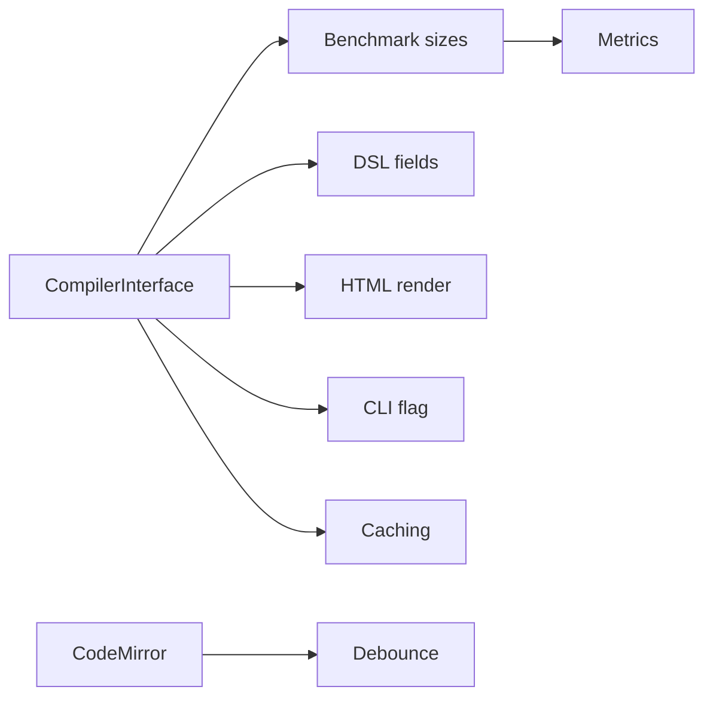

# PoC: Web Server with Runtime Compilation Benchmarks

**Framework:** CICO (Context-In-Consequences-Out)

**Date:** 2026-07-17

**Duration:** ~10 turns

## TLDR

First PoC for KResume: a local web server (`kresume web`) with a split-pane browser IDE
— CodeMirror 5 editor (left), HTML iframe preview (right). Users type a
`resume { basics { ... } work { ... } }` DSL. On 1s debounce, the server compiles
it via one of three runtime backends (JSR 223, kctfork, raw kotlin-compiler-embeddable),
returns HTML. A separate `/bench` page benchmarks all three approaches: 50/200/500-line
DSL snippets × 10 cold + 50 hot runs × full metric set (P50/P95/P99/mean/std dev/min/max
+ cold-start + heap delta + GC pause).

Goal: determine if runtime Kotlin compilation is fast enough for a sub-second hot-reload
IDE experience.

## Discussed

- **Benchmark methodology**: progressive DSL sizes (50, 200, 500 lines), 10 cold + 50 hot
  iterations per approach.
- **Key metrics**: P50, P95, P99, mean, std dev, min, max for hot runs + cold-start time
  + heap delta + GC pause.
- **Compiler interface**: all three approaches implement a common
  `sealed class CompileResult` returning `Success(Resume, timing)` or
  `Error(message, line, col)`.
- **DSL design**: `resume { basics { ... } work { ... } }` builder DSL. All fields
  nullable with defaults. No Markdown. Multiple `work { }` blocks for multiple jobs.
- **Web framework**: Ktor 3.5.1 (Netty engine), embedded server in `main()`.
- **Frontend**: CodeMirror 5 static bundle (no npm/bundler), plain iframe preview with
  inline CSS. 1s frontend debounce.
- **Engine selection**: CLI flag at startup (`--engine=jsr223|kctfork|raw`).
- **PDF for live preview**: rejected for PoC (110-160ms vs HTML 10ms — 11-16x slower,
  CSS limitation). Documented as post-PoC export idea.
- **Scroll**: plain iframe native scroll.

## Decisions

| # | Decision | Risk | Priority | Effort | Dependencies | Confidence |
|---|----------|------|----------|--------|--------------|------------|
| 1 | Common `ResumeCompiler` interface for all 3 approaches | low | P1 | S | — | 5/5 |
| 2 | Progressive benchmark sizes: 50/200/500 lines | low | P1 | S | #1 | 5/5 |
| 3 | Metrics: P50/P95/P99/mean/std dev/min/max + cold + heap + GC | low | P1 | M | #2 | 4/5 |
| 4 | All DSL fields nullable with defaults | low | P1 | S | #1 | 5/5 |
| 5 | CodeMirror 5 static bundle (no npm/bundler) | low | P1 | S | — | 5/5 |
| 6 | Ktor 3.5.1 Netty embedded server | low | P1 | M | — | 5/5 |
| 7 | Inline CSS, string template HTML | low | P1 | S | #1 | 5/5 |
| 8 | HTML only for live preview (no PDF) | low | P1 | S | #7 | 5/5 |
| 9 | Single `:server` module (not split) | low | P1 | S | — | 5/5 |
| 10 | CLI flag for engine selection | low | P1 | S | #1 | 5/5 |
| 11 | 1s frontend debounce | low | P1 | S | #5 | 4/5 |
| 12 | Cached singleton engine (warm), recreate for cold | low | P1 | M | #1 | 5/5 |
| 13 | No import/export, no AI, no persistence in PoC | low | P1 | S | — | 5/5 |
| 14 | Measure first, decide after on latency threshold | low | P1 | S | #2, #3 | 5/5 |

### Rankings

**Decision 1 (compiler interface)**: 1. sealed class CompileResult, 2. Exceptions + Pair
**Decision 11 (debounce)**: 1. 1s frontend (chosen), 2. 300ms frontend, 3. server-side

## Dependency Graph



## Architecture Sketch

```
┌───────────── Browser ──────────────────────┐
│  /           /bench                         │
│  ┌─────────┐ ┌─────────────────────────┐    │
│  │ Editor  │ │ Benchmark table          │    │
│  │ (CM5)   │ │ Engine | 50 | 200 | 500  │    │
│  ├─────────┤ │ JSR223 | ms | ms  | ms   │    │
│  │ Preview │ │ kctfork | ms | ms  | ms   │    │
│  │ (iframe)│ │ raw     | ms | ms  | ms   │    │
│  └────┬────┘ └─────────────────────────┘    │
│       │ POST /api/compile                   │
│       │ POST /api/bench                     │
└───────┼─────────────────────────────────────┘
        │
┌───────┴──── JVM Server ───────────────────┐
│  Main.kt: embeddedServer(Netty, port=8080)  │
│                                              │
│  POST /api/compile                           │
│    → Route calls ResumeCompiler.compile()    │
│    → Sealed: Success(Resume, ms) | Error     │
│    → Success → HtmlRenderer.render(Resume)   │
│    → Return { status, html, compileTimeMs }  │
│                                              │
│  POST /api/bench                             │
│    → Loads predefined DSL snippets           │
│    → Runs R iterations on each               │
│    → Returns { engine, size, stats[] }       │
│                                              │
│  Engines (selected by --engine flag):        │
│    Jsr223Compiler   → kotlin-scripting-jsr223│
│    KctForkCompiler  → kctfork:core            │
│    RawCompiler      → kotlin-compiler-embeddable│
└──────────────────────────────────────────────┘
```

## Project Structure

```
server/
├── build.gradle.kts              # Ktor + JSR223 + kctfork deps
└── src/main/
    ├── kotlin/me/vitalir/kresume/server/
    │   ├── Main.kt               # Entry point: parse CLI, start server
    │   ├── Server.kt             # Ktor routes + static file serving
    │   ├── model/
    │   │   └── Resume.kt         # Resume, Basics, WorkEntry data classes
    │   ├── dsl/
    │   │   └── ResumeDsl.kt      # resume{}, basics{}, work{} builders
    │   ├── compiler/
    │   │   ├── ResumeCompiler.kt # interface + sealed CompileResult
    │   │   ├── ConsoleCompiler.kt # using kotlin-scripting-jsr223
    │   │   ├── KctForkCompiler.kt# using kctfork:core
    │   │   └── RawCompiler.kt   # using kotlin-compiler-embeddable directly
    │   ├── handler/
    │   │   ├── CompileHandler.kt # POST /api/compile logic
    │   │   └── BenchHandler.kt   # POST /api/bench logic
    │   └── render/
    │       └── HtmlRenderer.kt   # Resume → HTML string
    └── resources/
        ├── static/
        │   ├── index.html        # Split-pane IDE (CM5 editor + iframe)
        │   ├── bench.html        # Benchmark page (results table)
        │   ├── style.css         # IDE page styles
        │   └── app.js            # Debounced compile, iframe update
        └── bench/
            ├── basics_50.txt     # 50-line DSL (basics + ~5 work entries)
            ├── basics_200.txt    # 200-line DSL (basics + ~20 work entries)
            └── basics_500.txt    # 500-line DSL (basics + ~50 work entries)
```

## Dependencies

| Library | Version | Module |
|---------|---------|--------|
| `org.jetbrains.kotlin:kotlin-scripting-jsr223` | `2.4.0` | JSR 223 compiler |
| `dev.zacsweers.kctfork:core` | `0.13.0` | kctfork compiler |
| `org.jetbrains.kotlin:kotlin-compiler-embeddable` | `2.4.0` | Raw compiler |
| `io.ktor:ktor-server-core` | `3.5.1` | Server core |
| `io.ktor:ktor-server-netty` | `3.5.1` | Netty engine |
| `io.ktor:ktor-server-content-negotiation` | `3.5.1` | JSON serialization |
| `io.ktor:ktor-serialization-kotlinx-json` | `3.5.1` | JSON codec |
| CodeMirror 5 | `5.65.21` | Static bundle (3 files) |

All compatible with Kotlin `2.4.0`. Add to `gradle/libs.versions.toml` version catalog.

## CodeMirror 5 Setup

- Download: `https://codemirror.net/5/codemirror.zip`
- Extract 3 files:
  - `lib/codemirror.js` → `resources/static/codemirror/lib/codemirror.js`
  - `lib/codemirror.css` → `resources/static/codemirror/lib/codemirror.css`
  - `mode/clike/clike.js` → `resources/static/codemirror/mode/clike/clike.js`
- Activate: `mode: "text/x-kotlin"` in `CodeMirror.fromTextArea()`
- No npm, no bundler, no CDN needed

## Open Questions

- **50/200/500-line DSL generation**: programmatic generation in Kotlin (function
  that takes entry count) or hand-crafted text files in `resources/bench/`?
  → Decision: use hardcoded `.txt` files in `resources/bench/`.
- **GC pause measurement**: `ThreadMXBean.getThreadCpuTime()` or a GC notification
  listener? → For PoC, simple `Runtime.getRuntime().totalMemory() - freeMemory()`
  before/after each compile and max GC pause via
  `ManagementFactory.getGarbageCollectorMXBeans()`.
- **Benchmark endpoint response format**: needs designing. Something like:
  ```json
  {
    "engine": "jsr223",
    "size": 200,
    "coldStartMs": 1234,
    "hot": {
      "p50": 127, "p95": 312, "p99": 450,
      "mean": 150, "stdDev": 45, "min": 98, "max": 510
    },
    "heapDeltaKb": 256,
    "gcPauseMs": 15
  }
  ```

## PDF Export Idea (post-PoC)

For the future "Export PDF" feature, the approach would be:

1. **Library**: OpenHTMLtoPDF (`com.openhtmltopdf:openhtmltopdf-pdfbox:1.0.10`)
   — pure Java, ~30-60ms for a 1-2 page resume, ~5MB JAR, no native deps.
2. **Integration**: Button in the IDE toolbar → server generates PDF from the
   same DSL → browser downloads PDF file or opens in new tab.
3. **CSS limitation**: OpenHTMLtoPDF doesn't support flexbox/grid. Resume templates
   need to use tables/floats for PDF export. May require a separate PDF-specific
   CSS template.
4. **Alternative for later**: Playwright (headless Chrome) for full CSS support,
   but adds +300MB Chromium binary. Overkill for PoC.
5. **Why not live preview**: ~110-160ms total latency vs HTML's ~10ms.
   11-16x slower per keystroke. CSS template split adds maintenance burden.
   HTML-first for preview, PDF-on-export is the standard pattern.

## Actions

| Action | Priority | Effort | Details |
|--------|----------|--------|---------|
| Add `:server` module with `build.gradle.kts` + `settings.gradle.kts` update | P1 | S | Register in settings, add deps to libs.versions.toml |
| Implement `Resume` data model + DSL builders | P1 | S | model/Resume.kt + dsl/ResumeDsl.kt |
| Implement 3 compiler backends + `ResumeCompiler` interface | P1 | M | compiler/ResumeCompiler.kt + 3 implementations |
| Implement Ktor server with routes | P1 | M | Main.kt, Server.kt, handler/CompileHandler.kt |
| Implement HTML renderer (string templates) | P1 | S | render/HtmlRenderer.kt |
| Create frontend: index.html + app.js + style.css | P1 | M | CM5 editor, iframe preview, debounce |
| Create benchmark: bench.html + bench handler | P2 | M | bench.html, handler/BenchHandler.kt, bench/ DSL snippets |
| Download and bundle CodeMirror 5 static files | P1 | S | 3 files from codemirror.net zip |
| Create benchmark DSL snippets (50, 200, 500 lines) | P1 | S | resources/bench/*.txt |
| Document PDF export idea (this doc) | P2 | S | Already done |
